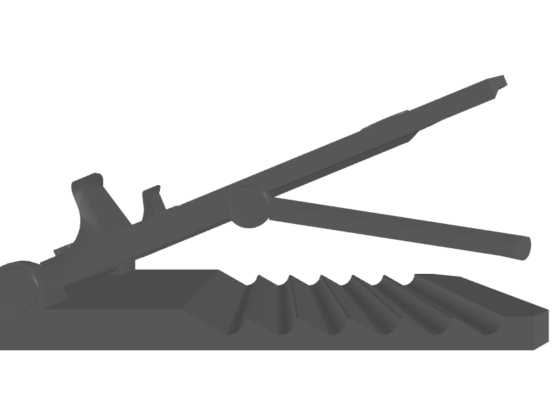

 # Valentine Gifts (Custom Phone Stands)

 This project contains 3D model files for personalized phone stands given as Valentine’s gifts.

 ## Original Source

 This design is based on the MakerWorld model: [https://makerworld.com/en/models/1054400?from=search#profileId-1041662](https://makerworld.com/en/models/1054400?from=search#profileId-1041662)

 ## Files

 - Alben.3mf
 - Alben.stl
 - Armstead.3mf
 - Armstead.stl
 - Baldwin.3mf
 - Baldwin.stl
 - Edens.3mf
 - Edens.stl
 - English.stl
 - Foldable+Phone+Stand+V2+_stls.zip
 - Newnham.stl
 - phonestand_original.stl
 - Phonestand_pengpenglulu_valentines.3mf
 - Phonestand_pengpenglulu_valentines.stl
 - Thurman.stl
 - Watson.3mf
 - Watson.stl

 ## Gift Recipients

 - Ms. Armstead – gift from Boda
 - Ms. Thurman – gift from Boda and Kaikai
 - Ms. Newnham – gift from Boda and Kaikai
 - Mr. Alben – gift from Boda and Kaikai
 - Ms. Edens – gift from Boda
 - Ms. English – gift from Boda
 - Ms. Watson – gift from Kaikai
 - Ms. Baldwin – gift from Kaikai

 ## Printing Instructions

 1. Open any `.3mf` project file in your slicing software (e.g., PrusaSlicer).
 2. Review or adjust print settings (layer height, infill, supports).
 3. Slice and export G-code.
 4. Print with PLA or PETG material; recommended settings:
    - Layer height: 0.2 mm
    - Infill: 20%
    - Supports: as needed

 ## License

 This model is licensed under the **Standard Digital File License (SDFL)** provided by MakerWorld. For details, see [MakerWorld’s licensing page](https://makerworld.com/en/info/licensing).

## Previews

